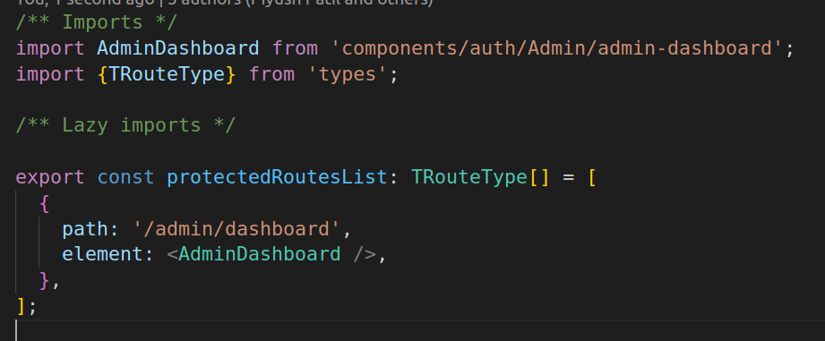

# Auth Module Frontend #

Auth Module for React using TypeScript.

This module provides an easy way to implement authentication in your application. It includes the folling functionality:

* Sign Up
* Sign In
* Forgot Password
* Reset Password
* Captcha verification
* Two-Factor Authentication (2FA)
* Amazon Cognito API integration

### Installation ###

We assume that the user already has an existing React project using TypeScript. You can also use the auth-integration-testing repo for integration testing.

* git clone the `auth-module-frontend` repository
* Go to dir `auth-module-frontend`
* run `npm install`
* run `npm link` (If it gives access errors, run sudo npm link --force)

Go to the existing React project root dir.

* run `npm link auth-module-frontend`
* run `npx auth-module-frontend`

This will create an auth directory, some TypeScript files and install the required dependencies. It will also prompt you to select some options like choosing a build tool, UI library and enter credentials, access keys or secret keys.

### Some requirements and assumptions ###
* Tested on React v18.2.0
* You should have a .env file present in the root dir
* For routing, add the following code to the src/routes/public.route.tsx file:
```
import { options } from 'auth-config';
import PrivacyPolicy from 'components/PrivacyPolicy/PrivacyPolicy.component';
import ForgotPassword from 'components/auth/forgot-password';
import PageNotFound from 'components/auth/pagenot-found';
import ResetPassword from 'components/auth/reset-password';
import ResetPasswordCognito from 'components/auth/reset-password-cognito';
import SignIn from 'components/auth/sign-in';
import SignUp from 'components/auth/sign-up';
import VerifyOTP from 'components/auth/verify';
import {TRouteType} from 'types';

const publicRoutesList: TRouteType[] = [
  {
    path: '/privacy-policy',
    element: <PrivacyPolicy />,
  },
  {
    path: '*',
    element: <PageNotFound />,
  },
  {
    path: '/sign-in',
    element: <SignIn />,
  },
  {
    path: '/sign-up',
    element: <SignUp />,
  },
  {
    path: '/verify',
    element: <VerifyOTP />,
  },
  {
    path: '/forgot-password',
    element: <ForgotPassword />,
  },
];

if (options.cognito) {
  publicRoutesList.push({
    path: '/reset-password',
    element: <ResetPasswordCognito />,
  });
} else {
  publicRoutesList.push({
    path: '/reset-password/:id',
    element: <ResetPassword />,
  });
}

export { publicRoutesList };
```
{width=300px;}

* Add this in protected route, having the path `/src/routes/protected.route.tsx`
```
import AdminDashboard from 'components/auth/Admin/admin-dashboard';
import {TRouteType} from 'types';

export const protectedRoutesList: TRouteType[] = [
  {
    path: '/admin/dashboard',
    element: <AdminDashboard />,
  },
];
```

{width=300px;}

* Change/update the code in the index file, having the path `src/custom/index.tsx`
```
const getProtectedRouteList = (protectedRouteList: TCustomRoute['protected']): RouteObject[] => {
  if (protectedRouteList && protectedRouteList.length > 0) {
    return protectedRouteList.map((item: RouteObject) => ({
      ...item,
      errorElement: <CustomErrorBoundary />,
      loader: () => {
        const authToken = localStorage.getItem('auth_token');
        const role = localStorage.getItem('userRole');
        if ((authToken && authToken !== '') && (role === 'admin' || role === 'superAdmin')) {
          return true;
        }
        return redirect(withOutLoginTokenRedirect);
      },
    }));
  }
  return [] as RouteObject[];
};
```

{width=300px;}

* Make the following changes to the MainPage.tsx file:
```
import Header from 'components/Header/Header.component';
import AppSidebar from 'components/Sidebar/Sidebar.component';
import MainHome from 'components/auth/home';

/* this is the landing page for the project which
 includes the header and sidemenu */
const MainPage: React.FC<Record<string, unknown>> = () => (
  <>
    <Header />
    <MainHome />
    <AppSidebar />
  </>
);
export default MainPage;
```

{width=300px;}

* If you intend to use Azure AD, make the following changes in main.tsx file:
```
import React from 'react';
import ReactDOM from 'react-dom/client';
import {LabelProvider} from 'providers';
import 'i18n/i18n';
import './variable.css';
import 'themes/theme.scss';
import {App} from 'App';
import { ToastContainer } from 'react-toastify';
import { MsalProvider } from '@azure/msal-react';
import { PublicClientApplication } from '@azure/msal-browser';
import { msalConfig } from 'components/auth/AzureAD/azureConfig';

const msalInstance = new PublicClientApplication(msalConfig);

ReactDOM.createRoot(document.getElementById('root') as HTMLElement).render(
  <React.StrictMode>
    <ToastContainer />
    <MsalProvider instance={msalInstance}>
      <LabelProvider>
        <App />
      </LabelProvider>
    </MsalProvider>
  </React.StrictMode>,
);
```

{width=300px;}

### Supported Build Tools ###
* Create React App
* Vite

### Supported UI Libraries ###
* React MUI

### Sample .env file for Create React App ###
```
REACT_APP_API_BASE_URL=http://localhost:5001/api/v1
REACT_APP_RECAPTCHA_SITE_KEY="your.site.key"
```

### For Azure AD ###
```
REACT_APP_AZURE_AD_CLIENT_ID=clientId
REACT_APP_AZURE_AD_AUTHORITY="https://login.microsoftonline.com/yourId"
REACT_APP_AZURE_AD_REDIRECT_URL=/sign-in
REACT_APP_AZURE_AD_GRAPH_API_URL=/me
```

| Env Constant                          | Description                                                                |
| --------------------------------------| ---------------------------------------------------------------------------|
| **REACT_APP_API_BASE_URL**            | The API base URL of the server                                             |
| **REACT_APP_RECAPTCHA_SITE_KEY**      | The Google reCAPTCHA V2 Checkbox site key to invoke the service on frontend|
| **REACT_APP_AZURE_AD_CLIENT_ID**      | The Azure AD client Id                                                     |
| **REACT_APP_AZURE_AD_AUTHORITY**      | The Azure AD authority                                                     |
| **REACT_APP_AZURE_AD_REDIRECT_URL**   | The Azure AD redirect URL                                                  |
| **REACT_APP_AZURE_AD_GRAPH_API_URL**  | The Azure AD Graph API URL                                                 |

### Sample .env file for Vite ###
```
VITE_APP_API_BASE_URL=http://localhost:5001/api/v1
VITE_APP_RECAPTCHA_SITE_KEY="your.site.key"
```

### For Azure AD ###
```
VITE_APP_AZURE_AD_CLIENT_ID=clientId
VITE_APP_AZURE_AD_AUTHORITY="https://login.microsoftonline.com/yourId"
VITE_APP_AZURE_AD_REDIRECT_URL=/sign-in
VITE_APP_AZURE_AD_GRAPH_API_URL=/me
```

| Env Constant                          | Description                                                                |
| --------------------------------------| ---------------------------------------------------------------------------|
| **VITE_APP_API_BASE_URL**             | The API base URL of the server                                             |
| **VITE_APP_RECAPTCHA_SITE_KEY**       | The Google reCAPTCHA V2 Checkbox site key to invoke the service on frontend|
| **VITE_APP_AZURE_AD_CLIENT_ID**       | The Azure AD client Id                                                     |
| **VITE_APP_AZURE_AD_AUTHORITY**       | The Azure AD authority                                                     |
| **VITE_APP_AZURE_AD_REDIRECT_URL**    | The Azure AD redirect URL                                                  |
| **VITE_APP_AZURE_AD_GRAPH_API_URL**   | The Azure AD Graph API URL                                                 |

### Config file ###

A config file gets created: `src/auth-onfig.ts` based on the user input selection when installing the module.

```
export const options = {
    "UIPackage": "MUI",
    "captcha": false,
    "2FA": false,
    "cognito": true
}
```

* The property `captcha` is for Google reCAPTCHA.
* The property `2FA` is for 2FA.
* The property `cognito` is for Amazon Cognito.
* The properties can be enabled and disabled by setting it to `true` and `false` respectively.
* Note: The client server needs to be restarted for this change to take effect. You also need to have proper values of the required env variables.

### Access ###
This module is intended for use within the Konverge AI organization. Anyone, who wants access, can send an email to dpe@konverge.ai

#### Contributors
* Pawel Borkar - [pawel.borkar@konverge.ai](pawel.borkar@konverge.ai)
* Monal Barange - [monal.barange@konverge.ai](monal.barange@konverge.ai)
* Shivali Umbarkar - [shivali.umbarkar@konverge.ai](shivali.umbarkar@konverge.ai)
* Rushikesh Gomekar - [rushikesh.gomekar@konverge.ai](rushikesh.gomekar@konverge.ai)